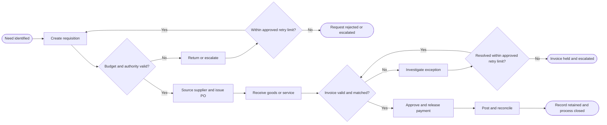

# Example catalog

## Mục lục

1. Cách dùng examples
2. Procure-to-Pay
3. Order-to-Cash
4. Record-to-Report
5. Identity-to-Access-to-Revoke
6. Mini-cases mở rộng
7. Policy–SOP conflict
8. Mẫu risk, control, RCM, SoD và SPOF
9. Open-world and evidence-bounded illustrations

## 1. Cách dùng examples

Dùng examples để hiểu cấu trúc và mức chi tiết, không dùng như process/control bắt buộc cho mọi doanh nghiệp. Thay roles, systems, thresholds, evidence và requirements bằng dữ liệu đã xác minh của organization. Mọi nội dung dưới đây là illustrative và thuộc `Target-State` trừ khi ghi khác.

## 2. Procure-to-Pay

### Intake tóm tắt

| Thuộc tính | Ví dụ |
|---|---|
| Objective | Mua hàng hóa/dịch vụ hợp lệ, đúng nhu cầu, đúng thời điểm và thanh toán chính xác. |
| Trigger | Nhu cầu mua được business requester ghi nhận. |
| End state | Supplier được thanh toán, transaction được hạch toán và records được lưu. |
| Customer | Business requester, supplier, finance và management. |
| Boundary | Từ purchase need đến payment/accounting close. |
| Layer | Target-State illustration. |

### Process hierarchy

- L0: Supply Chain and Finance
- L1: Procure-to-Pay (`P2P`)
- L2: Procurement; Receiving; Accounts Payable; Payment; Accounting
- L3: Purchase Requisition; Vendor Selection; Purchase Order; Goods Receipt; Invoice Processing; Payment Release
- L4: Review purchase request
- L5: Verify budget code and required attachments

### Step register rút gọn

| Step | Performer | Action | Key risk | Illustrative control |
|---|---|---|---|---|
| STEP-P2P-01 | Requester | Create purchase request | Invalid or unnecessary purchase | Mandatory fields and documented business need |
| STEP-P2P-02 | Budget owner | Review budget and authority | Unauthorized commitment | Approval against current delegation matrix |
| STEP-P2P-03 | Procurement | Source/select supplier | Conflict, bias or poor supplier | Sourcing protocol and conflict declaration |
| STEP-P2P-04 | Purchasing system | Issue purchase order | Order differs from approval | PO generated from approved request |
| STEP-P2P-05 | Receiver | Record receipt | Fictitious or inaccurate receipt | Receipt evidence and quantity/quality check |
| STEP-P2P-06 | Accounts Payable | Process invoice | Duplicate/invalid invoice | Duplicate detection and match logic |
| STEP-P2P-07 | Treasury | Release payment | Unauthorized payment | Payment batch review and bank authorization |
| STEP-P2P-08 | Accounting | Reconcile and close | Misstatement remains undetected | Reconciliation and exception follow-up |

### Mermaid illustration

Không coi flow trên là BPMN 2.0 đã được chuyên gia review.

## 3. Order-to-Cash

### Boundary và subprocesses

- Trigger: customer demand hoặc accepted quote.
- End state: cash applied, receivable resolved và order records retained.
- Typical subprocesses: customer onboarding, credit assessment, order entry, pricing/discount approval, fulfillment, shipment, billing, collection, cash application, dispute/credit note.

### Risks và control objectives minh họa

| Risk | Control objective |
|---|---|
| Invalid customer or credit exposure | Only valid customers within approved credit terms transact. |
| Unauthorized price/discount | Prices and discounts follow approved conditions and authority. |
| Shipment not billed | All valid shipments are completely and timely billed. |
| Cash applied to wrong account | Receipts are accurately and promptly matched to receivables. |

### Metrics minh họa

- KPI: order-to-delivery cycle time; perfect-order rate.
- KRI: credit override rate; overdue receivable concentration.
- KCI: unbilled shipment exception aging; credit review completion rate.

Không đặt target nếu chưa có baseline, appetite và service commitment.

## 4. Record-to-Report

### Typical flow

`Transaction capture → Journal processing → Account reconciliation → Consolidation → Close adjustments → Financial reporting → Post-close review`.

### Control patterns minh họa

- restricted journal preparation/posting rights;
- independent approval for defined journal populations;
- reconciliation with completeness, preparer/reviewer evidence and aging follow-up;
- consolidation validation and intercompany elimination;
- disclosure checklist mapped to applicable reporting requirements;
- post-close adjustment monitoring.

Không suy ra operating effectiveness từ việc control xuất hiện trong close calendar hoặc SOP.

## 5. Identity-to-Access-to-Revoke

### Layers

- `As-Documented`: policy yêu cầu manager và application owner approval.
- `As-Designed`: workflow dự kiến xác thực role, SoD và employment status trước provisioning.
- `As-Performed`: chỉ xác nhận sau khi đối chiếu access tickets, directory logs và application assignments.
- `Target-State`: event-driven joiner/mover/leaver workflow với periodic certification và emergency-access post-review.

### SoD illustration

| Conflict | Level | Status | Mitigation example |
|---|---|---|---|
| Request access and approve same request | Process-role | Potential | Independent application-owner approval |
| Develop and deploy production change | System-access | Potential/actual depends on assignment | Restricted deployment plus independent release approval |
| Create user and certify own access | Actual-user | Actual only with user evidence | Independent certification and exception monitoring |

## 6. Mini-cases mở rộng

### Hire-to-Retire

Bao phủ workforce approval, recruitment, screening, onboarding, personnel/master-data changes, time/payroll interface, performance, movement, termination, final settlement và access revocation. Không bỏ offboarding access và asset return.

### Source-to-Contract

Bao phủ sourcing strategy, bidder selection, evaluation, negotiation, legal/compliance review, approval, signature authority, contract repository và obligation handoff. Không coi legal review là process control đủ nếu obligations không được chuyển sang owner.

### Inventory-to-Deliver

Bao phủ inventory availability, reservation, picking, packing, dispatch, transport, proof of delivery, returns và adjustments. Tách custody, recordkeeping, count và adjustment approval khi khả thi.

### Plan-to-Produce

Dùng acronym `Plan2Produce` hoặc `P2Prod`, không chiếm `P2P`. Bao phủ demand/production planning, material readiness, scheduling, execution, quality release, yield/scrap và inventory receipt.

### CAPEX-Idea-to-Asset

Bao phủ idea, business case, investment approval, procurement, project governance, capitalization, commissioning, handover, benefits realization và post-investment review.

### Quality-Event-to-CAPA

Bao phủ event intake, containment, severity, investigation, root cause, corrective/preventive actions, approval, implementation và effectiveness review. Không đóng CAPA chỉ vì action đã được ghi nhận.

### Third-Party Lifecycle

Bao phủ need, segmentation, due diligence, contracting, onboarding, access/data enablement, monitoring, incident handling, renewal, termination và exit/continuity plan.

## 7. Policy–SOP conflict

### Raw facts

- Policy version P-03 states approval above an unspecified threshold belongs to Role A.
- SOP version S-07 states approval above 500 million VND belongs to Role B.
- Delegation matrix version and effective date are not provided.

### Correct handling

1. Record the conflict; do not select A or B by intuition.
2. Validate document authority, version, effective date and delegated authority.
3. Label threshold and approver as `Unresolved`.
4. Assess interim risk without stating either document is legally controlling.
5. Request authoritative delegation evidence and owner decision.
6. Update policy/SOP/workflow/RCM only after human approval.

## 8. Mẫu records

### Risk statement

> Due to supplier bank details being changed without independent validation, a fraudulent or erroneous payment may be directed to an unauthorized account, resulting in financial loss and affecting the objective of accurate, authorized supplier payments.

### Testable control description

> The Vendor Master Data Team validates bank-account ownership, tax information and required approvals before activating or changing a vendor in the ERP. For each request, the performer retains the approved onboarding/change package and system audit log. Exceptions are blocked and escalated to the Procurement Manager within the approved service timeframe.

Các role, system và timeframe trên chỉ là illustration; thay bằng facts đã xác minh.

### RCM relationship row

| Field | Example |
|---|---|
| `rcm_id` | RCM-P2P-001 |
| `risk_id` | RSK-P2P-003 |
| `control_objective_id` | COBJ-P2P-003 |
| `control_id` | CTL-P2P-005 |
| `evidence_ids` | EVD-P2P-011; EVD-P2P-012 |
| `key_control` | To be validated |
| `design_assessment` | Not assessed |
| `residual_risk` | null — methodology not provided |

### SoD conflict

`SOD-P2P-001`: Create/modify vendor master + release supplier payment. Classify as potential at role-design level; classify as actual only after user entitlement/assignment evidence. Possible mitigation: independently approved vendor changes, payment validation against change reports and periodic access review.

### SPOF assessment

`DEP-R2R-004`: A consolidation specialist is the only current performer. Do not label SPOF until validating documented procedure, trained alternate, workload capacity, access, substitution lead time and close-calendar recovery tolerance. If an authorized alternate can perform within tolerance, record concentration concern rather than confirmed SPOF.

### Mandatory versus best practice

- `Mandatory`: an applicable law, regulation or contract expressly requires a control outcome; record official source, jurisdiction, effective version and clause.
- `Framework-aligned`: a recognized framework supports a control pattern; do not call it mandatory unless the organization adopted it or another binding source requires it.
- `Leading practice`: continuous monitoring may improve detection; present benefit, cost and applicability, not legal necessity.

## 9. Open-world and evidence-bounded illustrations

These are synthetic explanations of the method, not raw test fixtures, retained model outputs or evidence that a runtime has been tested. All organizations, source excerpts, controls and IDs in this section are fictional. Layer labels describe the illustration only; they do not assert facts about a user's organization.

### 9.1 A process without an exact seed label

A fictional museum describes: loan request, agreement, condition recording, transport, exhibition, return and condition reconciliation. The intended outcome is a returned object with its condition and responsibilities reconciled.

An analyst may propose the working name "Loan-Request-to-Verified-Return" and explain its boundary. This is an organization-specific candidate name, not an APQC or other standard process ID. Use the objective and handoffs to look for suitable process references; if the available sources do not support an exact match, retain the candidate mapping and ask the boundary questions that matter. The 94 seed names are not a limit on what can be analyzed.

### 9.2 A group of intersecting E2Es

A synthetic request includes a museum loan, contracted restoration, transport, return and payment. Map these as related E2Es with explicit handoffs. The presence of payments does not make the group a single P2P process.

Keep one logical control identity only when evidence supports a shared mechanism. Keep each scope and observation separate. A shared name does not prove shared identity.

### 9.3 SOP and partial log observations

The synthetic SOP describes two approvals before release. A partial log contains one approval event for one case. Log completeness has not been established.

| Logical control | Observation | Layer | Supported statement and scope |
|---|---|---|---|
| `CTL-SYN-001` | `OBS-SYN-DOC-001` | `As-Documented` | The fictional SOP describes two approvals for the workflow. |
| `CTL-SYN-001` | `OBS-SYN-PERF-001` | `As-Performed` | One approval event is visible in the supplied excerpt for one case. No claim is made about missing log events or the full period. |

Keep both observations with their source locators. The excerpt does not establish whether the second approval occurred. Request complete evidence and scope information; keep an unknown period null. Do not overwrite the SOP description, infer full-period operating effectiveness, or replace legacy `design_assessment`.

### 9.4 Unavailable baseline and greenfield design

A user asks for a new service process without supplying a current procedure. A relevant external library is unavailable through the permitted tools or access rights.

State which source content is unavailable. Continue with clearly labelled analyst risk/control proposals based on the supplied objective; do not claim a standard-derived baseline, successful library access or full benchmarking. Current observations and current `gap_ids` remain empty with the reason recorded. Recommendations can link to a design opportunity rather than an invented Missing Control.

### 9.5 Source expectation, design option and no-change exposure

A fictional internal requirement says: "Release equipment only after an authorized condition check." Within this illustration, the supported expectation is the authorized check before release. A proposed QR scan or automated hold is an analyst implementation option; the fictional requirement does not mandate that technology.

The fictional current procedure describes a signed manual checklist, but no operating evidence is supplied. The absence of QR scanning is not itself a gap: compare the manual control's objective, coverage, timing, independence and evidence before recommending replacement.

A possible no-change scenario is that an incomplete or unreviewed checklist could allow an unverified item to be released. Record the documented manual check as an existing protection with unverified operation, the remaining uncertainty and the evidence needed. This is a risk hypothesis, not a confirmed failed release. Leave unknown probability, loss and horizon unquantified; key-control designation still needs contextual rationale and review.

See [risk/control method](../references/risk-control-key-control.md), [gap and RCM method](../references/gaps-rationalization-rcm.md) and [comparison template](../templates/control-baseline-comparison.yaml) for the reusable records.
