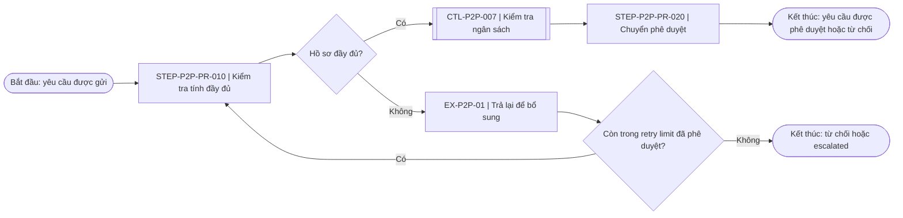
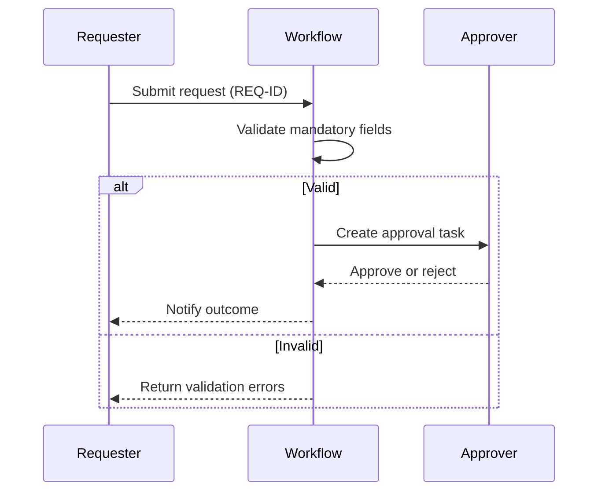

# Workflow, metrics, process mining và audit handoff

## Mục lục

1. [Chọn hình thức trực quan hóa](#1-chọn-hình-thức-trực-quan-hóa)
2. [Chuẩn hóa workflow elements](#2-chuẩn-hóa-workflow-elements)
3. [Tạo Mermaid an toàn](#3-tạo-mermaid-an-toàn)
4. [Tạo swimlane và BPMN conceptual model](#4-tạo-swimlane-và-bpmn-conceptual-model)
5. [Tạo RACI và decision-right matrix](#5-tạo-raci-và-decision-right-matrix)
6. [Thiết kế KPI, KRI và KCI](#6-thiết-kế-kpi-kri-và-kci)
7. [Phân tích process mining](#7-phân-tích-process-mining)
8. [Chuyển control thành test attributes](#8-chuyển-control-thành-test-attributes)
9. [Bàn giao cho Internal Audit](#9-bàn-giao-cho-internal-audit)
10. [Kiểm tra chất lượng](#10-kiểm-tra-chất-lượng)

## 1. Chọn hình thức trực quan hóa

Chọn view theo câu hỏi cần trả lời:

| Câu hỏi | View ưu tiên |
|---|---|
| Trình tự tổng quan là gì? | Simple flowchart |
| Ai làm gì và handoff ở đâu? | Cross-functional swimlane |
| Event, gateway, message và exception hoạt động ra sao? | BPMN 2.0 conceptual model |
| Cần biểu diễn bằng text portable? | Mermaid flowchart hoặc sequence diagram |
| Supplier, input, process, output, customer là ai? | SIPOC |
| Trách nhiệm và accountability thuộc về ai? | RACI |
| Quy tắc quyết định phân nhánh thế nào? | Decision tree / decision table |
| Dữ liệu đi qua system nào? | Data-flow / system-interaction view |
| Risks, controls hoặc exceptions nằm ở đâu? | Risk, control hoặc exception overlay |

Tạo process-step register trước khi vẽ. Giữ nguyên `step_id`, `risk_id`, `control_id`, `role_id` và `metric_id` giữa mọi view.

Khi không có diagram tool:

- Tạo Mermaid syntax.
- Tạo swimlane table và step register.
- Ghi rõ `Not rendered` và trạng thái validation.
- Không tuyên bố đã kiểm tra bằng mắt.

Khi có diagram tool:

- Kiểm tra availability và phạm vi tool trước khi gọi.
- Chọn Figma/FigJam, BPMN XML hoặc image artifact theo yêu cầu.
- Giữ source text hoặc machine-readable model để audit và sửa đổi.
- Xác minh output sau khi render; không coi tool success là logic success.

## 2. Chuẩn hóa workflow elements

Hỗ trợ tối thiểu các element:

| element_type | Ý nghĩa | Thuộc tính bắt buộc |
|---|---|---|
| `start_event` | Trigger khởi tạo case | event, source, boundary |
| `end_event` | Outcome hoặc termination | outcome, customer, status |
| `manual_task` | Người thực hiện activity | performer, input, output |
| `system_task` | System thực hiện action | system, rule, audit trail |
| `decision` | Đánh giá điều kiện | rule, routes, default/exception |
| `approval` | Authority quyết định | approver, criteria, evidence |
| `handoff` | Chuyển trách nhiệm hoặc data | sender, receiver, completion signal |
| `control` | Action xử lý risk | control_id, owner, timing, evidence |
| `exception` | Route ngoài happy path | trigger, authority, escalation |
| `loop` | Rework hoặc repeat | entry, exit, max/stop condition |
| `document/data` | Input, output hoặc record | object_id, source/system, classification |
| `SLA` | Cam kết timing | clock start/stop, target, owner |

Không để orphan node. Không để decision chỉ có một route hoặc route không có label. Không để flow thiếu start/end trừ khi ghi rõ đây là fragment.

Retry limit tối đa hai lần trong core `SKILL.md` chỉ điều khiển agent/tool subtask, không phải default cho business process. Trong workflow nghiệp vụ, không tự đặt số retry, SLA hoặc escalation threshold: lấy từ approved source; nếu chưa có, dùng một decision khái niệm `within approved retry/stop rule?`, để giá trị `To be validated` và yêu cầu Process Owner phê duyệt. ID trong draft fragment phải dùng prefix canonical hoặc giữ `Not provided`; không phát minh ID như thể đã được tổ chức ban hành.

## 3. Tạo Mermaid an toàn

Dùng ID ASCII ổn định và đặt label có dấu trong dấu ngoặc kép. Không đưa logic vào ID.



Kiểm tra Mermaid:

1. Dùng một ID duy nhất cho mỗi node.
2. Quote label chứa punctuation, dấu tiếng Việt hoặc ký tự đặc biệt.
3. Gắn label cho mọi decision route.
4. Giữ loop có exit condition; tránh vòng lặp vô hạn.
5. Không dùng style/color làm phương tiện duy nhất truyền tải ý nghĩa.
6. Chạy validator nếu có; nếu không, ghi `syntax_validation: not_run`.
7. Không nhúng dữ liệu Restricted hoặc Personal Data vào diagram.

Dùng sequence diagram cho system interaction:



## 4. Tạo swimlane và BPMN conceptual model

Tạo swimlane table khi cần portability:

| seq | step_id | Requester | Functional Team | Reviewer | Approver | System | handoff/evidence |
|---:|---|---|---|---|---|---|---|
| 1 | `<ID>` | Submit request |  |  |  | Validate fields | Request ID, timestamp |
| 2 | `<ID>` |  | Review request |  |  |  | Review record |

Không đặt một task ở nhiều lane. Nếu có collaboration, chọn accountable performer và mô tả participants riêng.

Khi tạo BPMN conceptual model:

- Phân biệt event, activity, gateway, pool, lane, message flow và sequence flow.
- Dùng task cho action; không dùng gateway thay task.
- Dùng exclusive gateway cho lựa chọn loại trừ và parallel gateway cho nhánh thực sự độc lập.
- Không dùng message flow giữa hai lane trong cùng pool.
- Thêm timer/error/escalation event khi timing hoặc exception là material.
- Kết nối mọi node; thêm start và end event.
- Ghi `Conceptual BPMN — chưa được chuyên gia BPMN review` nếu chưa có model validation.
- Không tạo BPMN XML nếu không thể kiểm tra tính hợp lệ hoặc người dùng không cần file machine-readable.

Tạo overlays riêng khi sơ đồ chính quá tải. Dùng mapping table để liên kết risk/control thay vì lặp nội dung dài trong node.

## 5. Tạo RACI và decision-right matrix

Phân biệt:

- `R — Responsible`: thực hiện công việc.
- `A — Accountable`: chịu trách nhiệm cuối cùng và có authority phù hợp.
- `C — Consulted`: cung cấp ý kiến trước quyết định.
- `I — Informed`: được thông báo.

Áp dụng quy tắc:

1. Gán đúng một `A` cho mỗi activity hoặc ghi rõ shared accountability đã được phê duyệt.
2. Gán ít nhất một `R` cho activity phải thực hiện.
3. Không mặc định Process Owner là Risk Owner, Control Owner, Policy Owner hoặc System Owner.
4. Kiểm tra self-approval, maker-checker và SoD conflict.
5. Tách role khỏi tên cá nhân; quản lý substitute và delegation riêng.
6. Đối chiếu RACI với approval matrix, SOP, workflow và system access.

Mẫu RACI:

| activity_id | activity | Requester | Performer | Reviewer | Approver | Process Owner | System Owner |
|---|---|---|---|---|---|---|---|
| `<ID>` | `<activity>` | R | R | C | A | I | C |

Khi authority phụ thuộc amount/entity/risk, tạo decision-right matrix thay vì ép vào một ô RACI.

## 6. Thiết kế KPI, KRI và KCI

Phân biệt metric:

- Dùng `KPI` để đo outcome, service hoặc process performance.
- Dùng `KRI` để đo exposure hoặc tín hiệu rủi ro.
- Dùng `KCI` để đo trạng thái, coverage hoặc effectiveness indicator của control.

Không đổi tên một metric thành KRI/KCI nếu objective và response không thay đổi. Một metric có thể liên quan nhiều mục tiêu nhưng phải có primary type rõ ràng.

Tạo metric record:

```yaml
metric_id: KCI-P2P-007
metric_type: KCI
metric_name: Three-way-match exception resolution rate
objective: Monitor timely resolution of match exceptions
formula: resolved_exceptions_within_sla / total_exceptions_due
unit: percent
population: invoice_match_exceptions
source: ERP exception log
owner: Accounts Payable Manager
frequency: monthly
target: organization-defined
thresholds: organization-defined
leading_or_lagging: leading
limitations: Depends on complete exception closure coding
data_quality_check: Reconcile exception population to invoice register
action: Investigate breach and assign remediation
escalation: Process Owner and Control Owner
```

Mọi metric phải có `formula`, numerator/denominator khi phù hợp, unit, population, source, owner, frequency, target, thresholds, leading/lagging, limitations, data-quality check, action và escalation.

Không hard-code threshold cho mọi organization. Nếu chưa có authority hoặc baseline, dùng `To be approved` và đề xuất calibration period.

Ví dụ tham khảo, không mặc định áp dụng:

- P2P: requisition-to-PO cycle time, maverick-spend rate, PO coverage, duplicate-invoice rate, emergency-purchase rate.
- O2C: order cycle time, credit override rate, billing error rate, DSO, overdue receivables.
- R2R: close cycle, late-journal rate, manual-journal rate, reconciliation completion, post-close adjustment rate.

## 7. Phân tích process mining

Chỉ chạy conformance hoặc variant analysis khi event log có semantics đủ rõ. Yêu cầu tối thiểu:

| Field | Bắt buộc | Kiểm tra |
|---|---|---|
| `case_id` | Có | Một case được định nghĩa nhất quán |
| `activity` | Có | Mapping event-to-activity ổn định |
| `timestamp` | Có | Time zone, granularity và ordering hợp lệ |
| `resource` | Nên có | Role/user mapping và privacy control |
| `system` | Nên có | Source lineage |
| `status` | Nên có | Completed/cancelled/reversed semantics |
| `amount` | Khi liên quan | Currency và sign convention |
| `entity` | Khi liên quan | Legal entity/business unit mapping |
| `document_id` | Khi liên quan | Traceability tới source transaction |

Trước phân tích:

1. Xác nhận population boundary và period.
2. Kiểm tra completeness, uniqueness, null, duplicate, late-arriving event và clock skew.
3. Chuẩn hóa activity name nhưng bảo toàn raw value.
4. Xác định start/end event và case split/merge rule.
5. Ghi excluded records và impact.
6. Phê duyệt data classification và masking.

Có thể phân tích actual variants, rework, bottleneck, skipped approval, out-of-sequence activity, duplicate activity, unauthorized path, cycle time, handoff delay, control bypass indicator, exception frequency và SOP conformance.

Phân chia trách nhiệm:

```text
Data Engineering
→ chuẩn bị, lineage và kiểm tra event log

Audit-Risk Analytics
→ chạy query/model, exception analytics và reproducibility

Process-Risk-Control
→ diễn giải process deviation, risk, control impact và validation action
```

Không kết luận control failure chỉ từ timestamp, rare variant hoặc conformance exception. Xác minh timezone, batch posting, approved exception, reversal, data loss và business context.

## 8. Chuyển control thành test attributes

Yêu cầu control description trả lời:

- What is performed?
- Who performs and who reviews it?
- When or on what trigger?
- On what population?
- Using what data and system?
- Against what criteria and at what precision?
- What evidence remains and where?
- How are exceptions resolved and escalated?

Chuyển thành test attributes phù hợp:

- Occurrence.
- Completeness.
- Accuracy.
- Authorization.
- Timeliness.
- Evidence.
- Exception follow-up.
- Reviewer independence.
- System configuration.
- Data reliability.

Phân biệt deliverable:

| Deliverable | Mục đích | Điều kiện |
|---|---|---|
| Walkthrough questions | Hiểu design và thực tế một case | Chưa kết luận operating effectiveness |
| Test of design | Đánh giá control có khả năng xử lý risk | Có control specification và source |
| Potential operating-effectiveness procedure | Đề xuất cách test | Chưa chốt sample/result |
| Data analytics procedure | Kiểm tra population hoặc exception | Có data lineage và logic reproducible |
| Evidence request | Thu thập evidence cần thiết | Tối thiểu hóa dữ liệu |
| Draft audit-program skeleton | Gợi ý objective, risk, procedure, evidence và data need | Internal Audit phải sở hữu scope, sampling, execution, findings và approval |

Không tự quyết định sample size cuối cùng nếu chưa biết population, risk, frequency, sampling methodology và reliance strategy.

## 9. Bàn giao cho Internal Audit

Tạo audit handoff package:

```yaml
handoff_id: HND-AUD-001
scope:
  process_ids: []
  entities: []
  period: null
analysis_layers: [As-Documented, As-Performed]
control_ids: []
risk_ids: []
source_register: []
population_definition: null
data_lineage: null
design_assessment: []
potential_test_procedures: []
evidence_request: []
known_deviations: []
assumptions: []
limitations: []
confidence: null
open_questions: []
approval_status: draft
```

Skill có thể chuẩn bị draft audit-program skeleton để handoff. Giữ Internal Audit chịu trách nhiệm audit objective, scope, program approval, sampling, execution, working papers, findings và audit conclusion. Không phát hành audit opinion thay Internal Audit.

Gắn rõ:

- Điều đã xác nhận và chưa xác nhận.
- Nguồn và version.
- Design assessment khác operating effectiveness.
- Data-quality work đã thực hiện.
- Potential procedure khác executed test.
- Human approvals còn mở.

## 10. Kiểm tra chất lượng

Trước khi bàn giao, xác nhận:

- Diagram có start, end, route label, exception phù hợp và không có orphan node.
- Swimlane owner khớp RACI và SOP.
- BPMN được gắn `conceptual` nếu chưa review chuyên môn.
- Mermaid đã validate hoặc ghi rõ chưa validate/render.
- Metric có formula, source, owner, action và data-quality check.
- Threshold không bị bịa hoặc áp dụng chung không căn cứ.
- Event log có case semantics, time handling, lineage và exclusions.
- Process-mining anomaly được trình bày như indicator trước validation.
- Control có đủ testable attributes.
- Audit handoff không tuyên bố sample result hoặc operating effectiveness chưa được test.
- IDs và source references nhất quán giữa workflow, RACI, metrics, mining và audit package.
